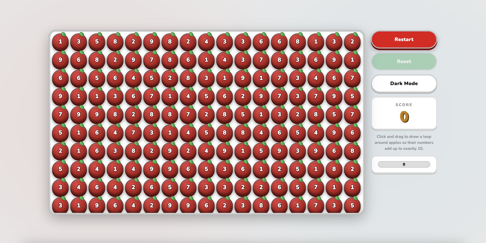

# 🍎 Alma Land

> A number puzzle game inspired by the apple orchards of **Almaty, Kazakhstan** — the genetic birthplace of the modern apple.



---

## 🎮 How to Play

```
1. Press  [ Start Game ]
2. Click and drag over apples
3. Numbers must add up to exactly 10
4. Score points — beat the clock!
```


## 🚀 Run Locally

```bash
npm install
npm run dev
```

---


